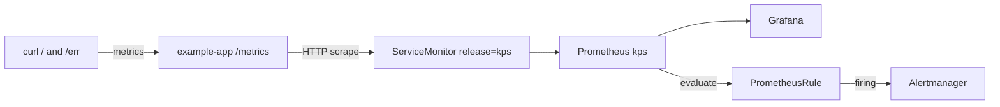

Here’s your cheat sheet from [Gemini 3.1 Pro](a4871eb1-2d41-4dfd-ba2d-b7e73f9f697f) — Deadpool tone, copy-ready:

---

# K8s Observability Interview Cheat Sheet
*(Deadpool edition — snark included, facts not optional)*

**Lab:** KodeKloud · **Cluster:** K3s (3 nodes) · **Stack:** `kube-prometheus-stack`  
**Helm release:** `kps` · **Namespace:** `monitoring` (+ `demo` for sample app)  
**Phase 1:** ✅ DONE · **Phase 2:** interview notes + architecture (Docker Compose optional, not required)

---

## 1) What You Actually Built

| Piece | What you deployed |
|---|---|
| **Helm chart** | `kube-prometheus-stack` as release **`kps`** |
| **Namespace** | `monitoring` |
| **Core pods** | Prometheus, Grafana, Alertmanager, operator, kube-state-metrics |
| **Workaround** | Disabled **node-exporter** (K3s mount drama) |
| **Sample app** | `example-app` in `demo` — `quay.io/brancz/prometheus-example-app:v0.5.0` |
| **Scrape** | `ServiceMonitor` with **`release: kps`** |
| **Alerts** | `PrometheusRule` + `LearningAlwaysFiring` |
| **Grafana** | Premade K8s dashboards + custom PromQL panels |
| **Lab access** | `port-forward --address 0.0.0.0` |

**Proof:**
- Targets: `example-app` → **2 endpoints UP**
- Metrics: `http_requests_total` (`200` + `404`)
- Alerts: `LearningAlwaysFiring` → **firing** via `vector(1)`
- Error rate after `/err`: `rate(...code="404"...)` ~0.5/s

---

## 2) Where You Are

```
Phase 1  ████████████████████  100% DONE
Phase 2  ░░░░░░░░░░░░░░░░░░░░  Interview notes / deepen K8s
Compose  ░░░░░░░░░░░░░░░░░░░░  Optional — skip if you know K8s
```

---

## 3) Core Flow (memorize this spine)

```
┌─────────────┐     ┌─────────────────┐     ┌─────────────┐
│  example-app│────▶│  ServiceMonitor │────▶│  Prometheus │
│  /metrics   │     │  (release: kps) │     │  (scrapes)  │
└─────────────┘     └─────────────────┘     └──────┬──────┘
       ▲                                            │
       │  curl /  and  /err                         │
       │                                            ▼
┌─────────────┐     ┌─────────────────┐     ┌─────────────┐
│ Alertmanager│◀────│  PrometheusRule │◀────│   Grafana   │
│ (routing)   │     │  (evaluates)    │     │ (visualize) │
└─────────────┘     └─────────────────┘     └─────────────┘
```

**One sentence:**  
*App exposes `/metrics` → ServiceMonitor tells Prometheus what to scrape → Prometheus stores series + evaluates PrometheusRule → Grafana visualizes; firing alerts go to Alertmanager.*



---

## 4) Status vs Targets vs Rules vs Alerts

| Page | Path | Meaning | Your lab |
|---|---|---|---|
| **Targets** | `/targets` | Who is scraped? UP/DOWN | `example-app` — 2 pods **UP** |
| **Rules** | `/rules` | Were rules loaded? | `learning.rules` |
| **Alerts** | `/alerts` | Live state: Inactive/Pending/Firing | `LearningAlwaysFiring` = Firing |
| **Query** | `/graph` | PromQL playground | `http_requests_total`, `rate(...)` |

**Decoder ring:**
- **Targets** = scrape working?
- **Rules** = recipe loaded?
- **Alerts** = smoke alarm screaming?
- Trap: rule in kubectl but “missing” in UI → check **Rules first**, not only Alerts

---

## 5) Key Facts

**Magic label:** `release: kps` on ServiceMonitor + PrometheusRule

**KodeKloud access:**
```bash
kubectl port-forward -n monitoring svc/kps-grafana 31346:80 --address 0.0.0.0
kubectl port-forward -n monitoring svc/kps-kube-prometheus-stack-prometheus 9090:9090 --address 0.0.0.0
```

**node-exporter disabled:** K3s mount error (`path "/" is not a shared or slave mount`). Still had kube-state-metrics + kubelet metrics.

---

## 6) PromQL Cheat Lines

| Query | Meaning |
|---|---|
| `http_requests_total` | Raw counters — scrape proof |
| `rate(http_requests_total[1m])` | req/s — **0 if idle** (normal) |
| `rate(http_requests_total{code="404",job="example-app"}[1m])` | 404 rate after `/err` |
| `vector(1)` | Always-firing pipeline test |
| `/` = 200, `/err` = 404, `/metrics` = scrape |

---

## 7) CRD One-Liners

| CRD | Line |
|---|---|
| **ServiceMonitor** | Scrape via Service |
| **PodMonitor** | Scrape pods directly (often empty = normal) |
| **PrometheusRule** | Evaluate PromQL → alert |

**Scrape ≠ Alert.** ServiceMonitor gets data in. PrometheusRule decides what to scream about.

---

## 8) Interview One-Liners

**What did you build?**  
*"kube-prometheus-stack on K3s, ServiceMonitor scrape of a sample app, PrometheusRule alerts, Grafana premade + custom dashboards."*

**How does discovery work?**  
*"Operator watches ServiceMonitors; label `release: kps` matches Prometheus selector → Targets UP."*

**Rules vs Alerts?**  
*"Rules = definitions loaded. Alerts = live state after `for:`."*

**Need Docker Compose?**  
*"No — same concepts on K8s. I already did the full loop with a public sample image."*

---

## 9) Wallet Card

```
LABEL:    release=kps
ACCESS:   port-forward --address 0.0.0.0
SCRAPE:   app → Service → ServiceMonitor → Targets UP
ALERT:    PrometheusRule → Rules → Alerts Firing → Alertmanager
TEST:     vector(1) → LearningAlwaysFiring
APP:      / = 200, /err = 404, /metrics = scrape
PROMQL:   rate(http_requests_total{code="404",job="example-app"}[1m])
SKIP:     node-exporter on K3s lab, Compose Phase
```

---

## 10) Optional next deep dives

- Alertmanager routing (`route`, `receiver`, `group_by`)
- Recording rules
- Loki + logs in Grafana

---

## If They Ask ONE Question — Say This

> *"I deployed kube-prometheus-stack on K3s, used ServiceMonitor with `release: kps` to scrape a sample app’s `/metrics`, validated Targets UP, built Grafana dashboards from PromQL, and proved alerting end-to-end with a PrometheusRule — including `vector(1)` — because scrape config and alert rules are separate, and you verify Rules loaded before you trust Alerts firing."*

*(Drop mic. Or don’t — HR might be watching.)*
